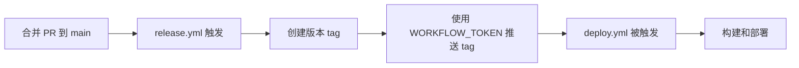

# GitHub Workflow Token 设置指南

## 问题说明

GitHub Actions 有一个安全限制：使用默认的 `GITHUB_TOKEN` 创建的 tag 或 commit **不会触发其他 workflows**。这是为了防止无限循环触发。

在我们的项目中：

- `release.yml` 使用 `GITHUB_TOKEN` 创建并推送 tag
- `deploy.yml` 监听 tag 推送事件
- 结果：`deploy.yml` 不会被触发 ❌

## 解决方案

使用 **Personal Access Token (PAT)** 替代 `GITHUB_TOKEN`，这样创建的 tag 可以触发其他 workflows。

## 设置步骤

### 1. 创建 Personal Access Token

1. 访问 GitHub 个人设置：

   - 点击右上角头像 → **Settings**
   - 左侧菜单选择 **Developer settings**
   - 选择 **Personal access tokens** → **Tokens (classic)**

2. 生成新 token：

   - 点击 **Generate new token (classic)**
   - **Note**: 填写 `WORKFLOW_TOKEN` 或其他描述性名称
   - **Expiration**: 建议选择 `No expiration` 或根据需求设置
   - **Select scopes**: 勾选以下权限
     - ✅ `repo` (完整仓库访问权限)
     - ✅ `workflow` (允许更新 GitHub Actions workflows)

3. 点击 **Generate token** 并**立即复制** token（离开页面后无法再次查看）

### 2. 添加到仓库 Secrets

1. 进入项目仓库设置：

   - 仓库页面 → **Settings**
   - 左侧菜单选择 **Secrets and variables** → **Actions**

2. 添加新 secret：
   - 点击 **New repository secret**
   - **Name**: `WORKFLOW_TOKEN`
   - **Secret**: 粘贴刚才复制的 PAT
   - 点击 **Add secret**

### 3. 验证配置

配置完成后，`release.yml` 已经更新为使用 `WORKFLOW_TOKEN`：

```yaml
steps:
  - name: Checkout Repo
    uses: actions/checkout@v4
    with:
      token: ${{ secrets.WORKFLOW_TOKEN }} # 使用 PAT 进行 git 操作

  # ... 其他步骤 ...

  - name: Create Release Pull Request or Publish to npm
    uses: changesets/action@v1
    env:
      GITHUB_TOKEN: ${{ secrets.WORKFLOW_TOKEN }} # 使用 PAT 创建 tag
```

### 4. 测试流程

1. 合并一个包含 changeset 的 PR 到 `main` 分支
2. `release.yml` 会自动运行并创建 tag
3. 创建的 tag 会触发 `deploy.yml` 运行 ✅

## 工作流程



## 注意事项

> [!IMPORTANT]
>
> - PAT 具有与你的 GitHub 账户相同的权限，请妥善保管
> - 不要将 PAT 提交到代码仓库中
> - 定期轮换 token 以提高安全性

> [!TIP]
> 对于组织仓库，可以考虑使用 **GitHub App** 替代 PAT，这样可以获得更细粒度的权限控制。

## 故障排查

### deploy.yml 仍未触发？

1. **检查 token 权限**：确保 PAT 包含 `repo` 和 `workflow` 权限
2. **检查 secret 名称**：必须是 `WORKFLOW_TOKEN`（大小写敏感）

### 如何验证 tag 是否创建？

在仓库中查看：

```bash
git fetch --tags
git tag -l "@my/*"
```

或访问 GitHub 仓库的 **Releases** 或 **Tags** 页面。

## 手动触发部署

`deploy.yml` 现在支持手动触发，你可以在 GitHub Actions 页面手动运行部署。

### 使用方法

1. **访问 Actions 页面**：

   - 进入仓库 → **Actions** 标签
   - 左侧选择 **Build & Deploy** workflow

2. **手动触发**：
   - 点击右上角的 **Run workflow** 按钮
   - 选择要运行的分支（通常是 `main`）
   - （可选）在 **Tag to deploy** 输入框中输入特定的 tag，例如 `@my/meta@1.0.0`
     - 如果留空，将部署当前分支的最新代码
   - 点击 **Run workflow**

### 使用场景

- **重新部署特定版本**：输入 tag 如 `@my/meta@1.0.0` 来部署历史版本
- **测试部署流程**：不输入 tag，直接部署当前分支代码
- **紧急修复**：快速触发部署而无需等待 tag 创建

> [!TIP]
> 手动触发时，workflow 会根据你的输入自动选择：
>
> - 如果提供了 tag：使用该 tag 的版本
> - 如果未提供 tag：使用当前分支的代码

## 故障排查

### deploy.yml 仍未触发？

1. **检查 token 权限**：确保 PAT 包含 `repo` 和 `workflow` 权限
2. **检查 secret 名称**：必须是 `WORKFLOW_TOKEN`（大小写敏感）
3. **检查 tag 格式**：确保 tag 匹配 `deploy.yml` 中的模式 `@my/*@*`
4. **查看 Actions 日志**：检查 `release.yml` 是否成功推送了 tag

## 参考资料

- [GitHub Actions: Triggering a workflow from a workflow](https://docs.github.com/en/actions/using-workflows/triggering-a-workflow#triggering-a-workflow-from-a-workflow)
- [Creating a personal access token](https://docs.github.com/en/authentication/keeping-your-account-and-data-secure/creating-a-personal-access-token)
